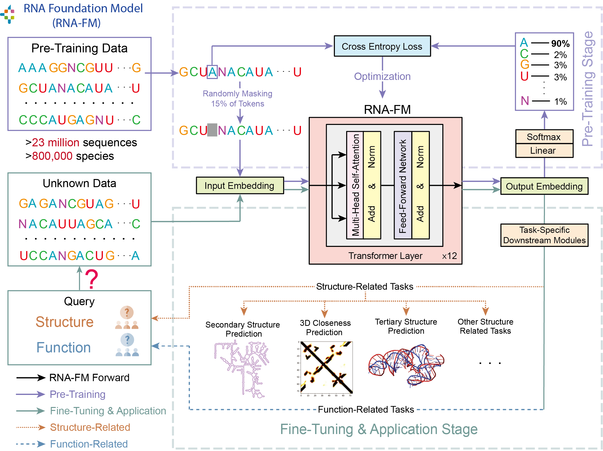
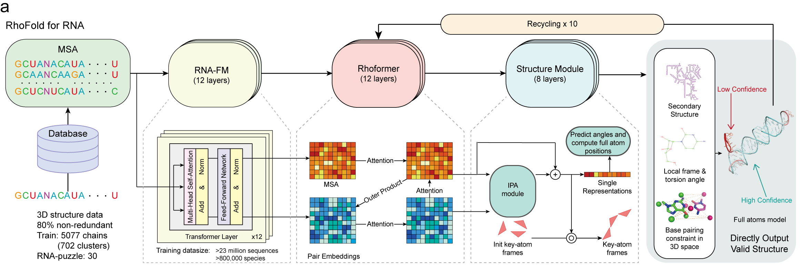

# Dillinger
## _The Last Markdown Editor, Ever_

[](https://nodesource.com/products/nsolid)

[](https://travis-ci.org/joemccann/dillinger)


## 前言

在生命科学的浩瀚领域中，RNA（核糖核酸）不仅是遗传信息的传递者，更在基因调控、蛋白质合成和细胞功能的调节中扮演着关键角色。RNA的结构直接影响其功能，尤其是其三级结构的精确折叠，对于理解生物学过程至关重要。然而，与蛋白质相比，RNA三级结构的预测和解析一直面临着更大的挑战。 RNA分子的结构比蛋白质更加多样且复杂。除了经典的Watson-Crick碱基对，RNA还能形成大量非典型的碱基对、三联体、四联体等复杂结构。这些非典型的相互作用极大地增加了预测的难度。此外，RNA分子具有高度的动态性和柔性，其结构能够适应不同的功能需求。这种灵活性使得单一的静态模型难以全面描述RNA的真实构象。 更为棘手的是，与蛋白质相比，已解析的高分辨率RNA三级结构数量相对较少。这不仅限制了机器学习模型的训练数据量，也增加了预测的难度。同时，RNA结构的实验解析（如X射线晶体学、核磁共振等）更加困难，获取新数据的速度较为缓慢。RNA的三级结构中还存在大量的长程相互作用，例如假结结构，这些复杂的相互作用难以通过传统的二级结构预测方法准确捕捉，需要更高级的算法和模型来解析。

鉴于上述挑战，过去在RNA三级结构的预测中，需要大量数据的深度学习模型鲜有涉足。传统的方法主要依赖于能量函数、模板建模和专家知识驱动。虽然这些方法在推进RNA结构理解方面确实起到了重要作用，但在精度和适用性上却受到了限制。 在人工智能领域，我们见证了AlphaZero击败李世石的突破，震惊了全球；在蛋白质折叠预测中，AlphaFold2取得了突破性的成绩。而如今，AlphaFold的创新性工作更是荣获了诺贝尔化学奖的认可。这一系列成就启发了我们：如果让人工智能从零开始学习RNA的知识，完全基于数据，而不依赖于专家的先验知识，是否有可能取得比依赖专家系统更好的成果？

## RNA语言模型

带着对这个理念的坚持和探索，李煜教授的团队从2021年开始，探索是否可以通过端到端的深度学习模型来预测RNA的三级结构。我们发现，虽然RNA的三级结构数据有限，但却拥有大量的序列信息。同时，进化信息也是结构预测的重要补充，但现有的RNA工具中，提取多序列比对（MSA）的工具仍然非常初级，效率不高。于是，我们先思考：能否利用大量未标注的RNA序列，来获取对结构有用的信息？ 在团队成员陈佳阳和胡智航的努力并与复旦大学的孙思琦教授合作中，我们共同构建了RNA的大语言模型——RNA-FM。该模型基于BERT架构，采用了掩码语言模型（Masked Language Modeling）的方法，在约两千三百万条RNA序列上进行了无监督训练。训练完成后，RNA-FM能够为长度为L的RNA序列生成维度为L×700的丰富嵌入表示。这些嵌入确实包含了大量的有帮助的信息。测试结果显示，相同的RNA家族在无监督的嵌入空间中能够自然地聚类在一起。此外，RNA-FM的嵌入表示还能够辅助构建进化树，并提升下游结构预测的性能。这一成果证明，在缺乏大量标注数据的情况下，利用深度学习和大规模的无监督训练，依然可以有效地挖掘RNA序列中的潜在信息。




## RNA三级结构预测

RNA-FM的成功为RNA三级结构预测提供了全新的思路和工具。通过无监督学习，我们克服了高分辨率结构数据缺乏的局限性，充分利用了海量的序列数据资源。这一基础上，我们与Zelix的王胜博士以及麻省理工学院（MIT）的团队展开合作，共同推动RNA三级结构预测模型的开发。RhoFold+作为这一系列研究的模型，整合了多项创新技术，构建了一个端到端的深度学习框架，专门用于RNA 3D结构的高效预测。

RhoFold+的架构主要由两个核心模块构成：Rhoformer特征处理模块和结构预测模块。在特征处理阶段，Rhoformer接收RNA-FM生成的序列嵌入信息，并结合通过Infernal和rMSA工具生成的多序列比对（MSA）数据。这些输入特征被引入Rhoformer主模块，用以捕捉RNA的进化模式和次级结构特征。Rhoformer通过一系列变换器（Transformer）和门控自注意力层，不仅提取了序列中的深层进化信息，还同时更新了序列嵌入和MSA表示。为了增强模型的特征表达能力，Rhoformer采用了一个特定的转换块，将嵌入维度扩大四倍，并利用四个自注意力块进一步精细化处理这些特征。最终，这些精炼的特征被传递到结构预测模块，以便对全原子三维坐标进行准确预测。

在结构预测模块方面，RhoFold+引入了一种名为不变点注意力（Invariant Point Attention, IPA）的几何感知注意力机制，用于建模RNA分子的三维空间位置。这一方法不同于AlphaFold2专注于蛋白质骨架旋转和平移矩阵的预测，RNA的折叠更依赖于核苷酸之间的碱基配对驱动。由于RNA结构模式存在不规则性，直接预测核苷酸的碱基框架（如C1'，N1/N9，C2/C4）在实验中可能面临收敛性问题。为此，RhoFold+采用了一种更为稳健的方法，通过框架（C4'，C1'，N1/N9）与四个扭转角（α，β，γ，ω）的组合来重建全原子坐标。预测过程采用迭代优化的策略，每次迭代后系统会将上一轮的预测结果反馈到Rhoformer进行进一步优化，直至预测的局部距离差异测试得分（pLDDT）达到收敛状态为止。

为了增强结构预测的生物学合理性，RhoFold+还引入了生物学约束，在三维空间中直接施加碱基配对等结构约束，从而提高预测结果的生物学有效性。与此同时，模型的损失函数设计也经过精心构思，涵盖了多层次的结构损失。这些损失函数包括：1D层面的掩码语言模型（MLM）损失，用于从多序列比对中提取共进化信息；2D层面的距离损失和二级结构损失，用以学习碱基对之间的空间相关性；以及3D层面的FAPE（框架对齐点误差）损失、二级结构约束损失和碰撞违约损失。这些多层次损失的组合，使得模型不仅能够在二维层面捕捉结构的局部几何关系，还能在三维空间中精确预测RNA结构的全局构象。




- Import a HTML file and watch it magically convert to Markdown
- Drag and drop images (requires your Dropbox account be linked)
- Import and save files from GitHub, Dropbox, Google Drive and One Drive
- Drag and drop markdown and HTML files into Dillinger
- Export documents as Markdown, HTML and PDF

Markdown is a lightweight markup language based on the formatting conventions
that people naturally use in email.
As [John Gruber] writes on the [Markdown site][df1]

> The overriding design goal for Markdown's
> formatting syntax is to make it as readable
> as possible. The idea is that a
> Markdown-formatted document should be
> publishable as-is, as plain text, without
> looking like it's been marked up with tags
> or formatting instructions.

This text you see here is *actually- written in Markdown! To get a feel
for Markdown's syntax, type some text into the left window and
watch the results in the right.

## Tech

Dillinger uses a number of open source projects to work properly:

- [AngularJS] - HTML enhanced for web apps!
- [Ace Editor] - awesome web-based text editor
- [markdown-it] - Markdown parser done right. Fast and easy to extend.
- [Twitter Bootstrap] - great UI boilerplate for modern web apps
- [node.js] - evented I/O for the backend
- [Express] - fast node.js network app framework [@tjholowaychuk]
- [Gulp] - the streaming build system
- [Breakdance](https://breakdance.github.io/breakdance/) - HTML
to Markdown converter
- [jQuery] - duh

And of course Dillinger itself is open source with a [public repository][dill]
 on GitHub.

## Installation

Dillinger requires [Node.js](https://nodejs.org/) v10+ to run.

Install the dependencies and devDependencies and start the server.

```sh
cd dillinger
npm i
node app
```

For production environments...

```sh
npm install --production
NODE_ENV=production node app
```

## Plugins

Dillinger is currently extended with the following plugins.
Instructions on how to use them in your own application are linked below.

| Plugin | README |
| ------ | ------ |
| Dropbox | [plugins/dropbox/README.md][PlDb] |
| GitHub | [plugins/github/README.md][PlGh] |
| Google Drive | [plugins/googledrive/README.md][PlGd] |
| OneDrive | [plugins/onedrive/README.md][PlOd] |
| Medium | [plugins/medium/README.md][PlMe] |
| Google Analytics | [plugins/googleanalytics/README.md][PlGa] |

## Development

Want to contribute? Great!

Dillinger uses Gulp + Webpack for fast developing.
Make a change in your file and instantaneously see your updates!

Open your favorite Terminal and run these commands.

First Tab:

```sh
node app
```

Second Tab:

```sh
gulp watch
```

(optional) Third:

```sh
karma test
```

#### Building for source

For production release:

```sh
gulp build --prod
```

Generating pre-built zip archives for distribution:

```sh
gulp build dist --prod
```

## Docker

Dillinger is very easy to install and deploy in a Docker container.

By default, the Docker will expose port 8080, so change this within the
Dockerfile if necessary. When ready, simply use the Dockerfile to
build the image.

```sh
cd dillinger
docker build -t <youruser>/dillinger:${package.json.version} .
```

This will create the dillinger image and pull in the necessary dependencies.
Be sure to swap out `${package.json.version}` with the actual
version of Dillinger.

Once done, run the Docker image and map the port to whatever you wish on
your host. In this example, we simply map port 8000 of the host to
port 8080 of the Docker (or whatever port was exposed in the Dockerfile):

```sh
docker run -d -p 8000:8080 --restart=always --cap-add=SYS_ADMIN --name=dillinger <youruser>/dillinger:${package.json.version}
```

> Note: `--capt-add=SYS-ADMIN` is required for PDF rendering.

Verify the deployment by navigating to your server address in
your preferred browser.

```sh
127.0.0.1:8000
```

## License

MIT

**Free Software, Hell Yeah!**

[//]: # (These are reference links used in the body of this note and get stripped out when the markdown processor does its job. There is no need to format nicely because it shouldn't be seen. Thanks SO - http://stackoverflow.com/questions/4823468/store-comments-in-markdown-syntax)

   [dill]: <https://github.com/joemccann/dillinger>
   [git-repo-url]: <https://github.com/joemccann/dillinger.git>
   [john gruber]: <http://daringfireball.net>
   [df1]: <http://daringfireball.net/projects/markdown/>
   [markdown-it]: <https://github.com/markdown-it/markdown-it>
   [Ace Editor]: <http://ace.ajax.org>
   [node.js]: <http://nodejs.org>
   [Twitter Bootstrap]: <http://twitter.github.com/bootstrap/>
   [jQuery]: <http://jquery.com>
   [@tjholowaychuk]: <http://twitter.com/tjholowaychuk>
   [express]: <http://expressjs.com>
   [AngularJS]: <http://angularjs.org>
   [Gulp]: <http://gulpjs.com>

   [PlDb]: <https://github.com/joemccann/dillinger/tree/master/plugins/dropbox/README.md>
   [PlGh]: <https://github.com/joemccann/dillinger/tree/master/plugins/github/README.md>
   [PlGd]: <https://github.com/joemccann/dillinger/tree/master/plugins/googledrive/README.md>
   [PlOd]: <https://github.com/joemccann/dillinger/tree/master/plugins/onedrive/README.md>
   [PlMe]: <https://github.com/joemccann/dillinger/tree/master/plugins/medium/README.md>
   [PlGa]: <https://github.com/RahulHP/dillinger/blob/master/plugins/googleanalytics/README.md>
